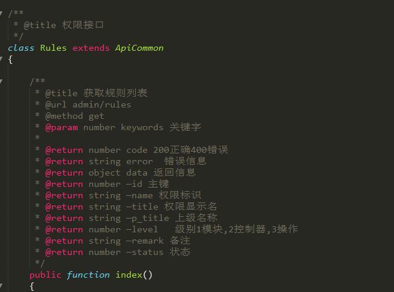
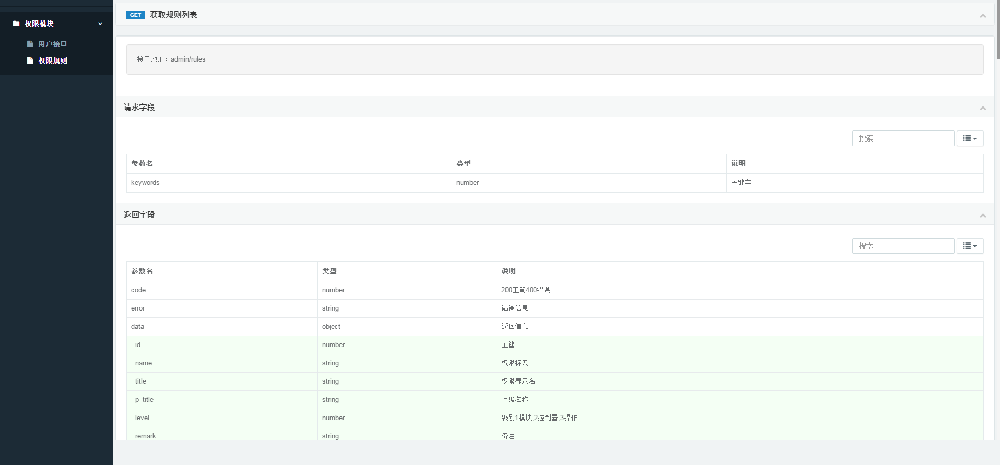

# honray-apilib
洪睿注释自动生成api文档模块

## 说明

根据TP5的资源路由restful风格，自动生成文档等功能；

 - restful风格处理请求
 > 每个接口对于一个控制器，method对应[method]Response方法响应
 
 - 文档生成
 > 简洁，优雅，不需要额外的文档工具;

 ## 相关依赖
 - [PHP5.4+]()
 - [ThinkPHP5.0.x](https://github.com/top-think/think) 基础框架
 - [Hadmin](https://git.oschina.net/liushoukun/hadmin.git) hAdmin是一个免费的后台管理模版,该模版基于bootstrap与jQuery制作，集成了众多常用插件，基本满足日常后台需要,修改时可根据自身需求;

 ## 目录结构


~~~
apilib
├─application           应用目录
│  ├─apilib             apilib目录
│  │  ├─Common.php      公共类库基础Rest
│  │  ├─BaseDoc.php     文档生成展示
│  │  ├─Behavior.php    行为类
│  │  └─ ...            

~~~

## 使用

#### 控制器注释
1，控制器类头加上如下注释
```php
/**
 * @title 用户接口
 */
class User extends Common{}
```


|参数|必须|备注|作用|
|:---:|:---:|:---:|:---:|
|title|true|接口标题|显示列表名称|

- 具体接口文档

2.接口描述信息(注释填写)
 
 
```php
    /**
    * @title 新增用户
    * @url admin/users
    * @method post
    * @param string —name 用户名称
    * @param string —remark 备注
    * 
    * @return number code 200正确400错误
    * @return string error  错误信息
    * @return string data 返回信息
    */ 
    public function index(){}

```

|参数|必须|备注|作用|
|:---:|:---:|:---:|:---:|
|title|true|接口标题|显示列表名称|
|url|true|访问接口|显示链接地址|
|method|true|请求方法|get，post，put，delete|
|param|true|请求参数|显示参数|
|return|true|返回参数|返回参数|



